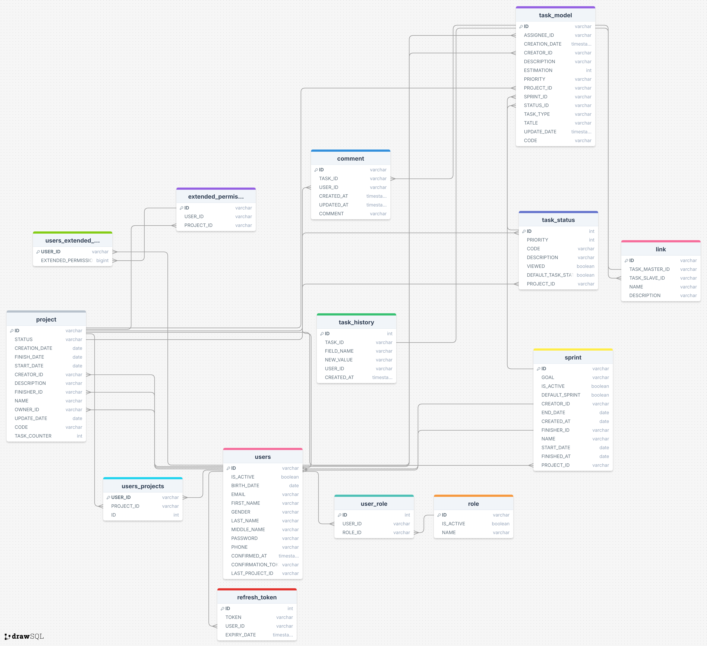

= WORK-TASK
:sectnums:
:sectnumlevels: 4
:stylesheet: WTDocStyles.css

Команда разработки:
|===
|Участник |Роль

|Прибытков Михаил,|разработчик (front-end), дизайнер (до 27.05.2025)

|Таранюк Виталий |руководитель проекта, аналитик

|Кузнецов Максим |аналитик

|Пузанова Дарья |аналитик (с 28.03.2025)

|Максименко Владислав |разработчик (back-end)

|Ерёменко Сергей |разработчик (back-end), devOps

|Крутаков Егор |разработчик (front-end), дизайнер

|Качановский Богдан |тестировщик

|Чайкин Денис |тестировщик

|Холодов Кирилл |тестировщик (с 26.04.2025), разработчик (front-end)

|Невский Андрей |тестировщик (с 29.04.2025)

|Мирзаев Шухрат |тестировщик (с 19.05.2025)

|Мастанов Михаил |консультант разработчиков (back-end) (с 12.05.2025)

|Григорий Вейнин|консультант разработчиков (front-end) (с 02.07.2025)

|Алена Епанчинцева |дизайнер (с 01.09.2025)

|Екатерина Леонтьева |разработчик Front-end (c 02.09.2025)

|Константин Суходолов |разработчик front-end (c 03.09.2025)
|===

Начало проекта 20 октября 2024 г.

== Цель проекта
-Создать простой и легковесный таск-трэкер

=== Основные функции
`==== Авторизация`
==== Управление пользователями
==== Ролевая модель
==== Создание и редактирование атрибутов проектов
==== Создание, редактирование, удаление задач
==== Управление спринтами

=== Нефункциональные требования
==== Безопасность (авторизация)
==== Количество пользователей не менее 100
==== БД – mySQL (ограничение по HDD на начало проекта – 2Гб)
==== Java версии 21
==== Разделение на фронт и бэк (REST API [JSON])
==== Простейший UI

=== Внешние ссылки
==== https://github.com/WorkTechDevelop/frontend[Frontend]
==== https://github.com/WorkTechDevelop/backend[Backend]
==== https://github.com/WorkTechDevelop/QA[Репозиторий для автотестов]
==== https://www.figma.com/design/mtrfLbTXPOSSHlcEP4YfQa/Project-Management-Dashboard-(Community)?t=y9ktO0um720nMaDS-0[Figma]

=== Сервера
==== Backend (http://91.211.249.37:31055)
====  Front (http://91.211.249.37:30080/)
==== ВМ  (91.211.249.37) креды у @segasegasson
==== Swagger (http://91.211.249.37/test/swagger-ui/index.html#/)
==== Test (http://91.211.249.37/test[http://91.211.249.37/test[https://xxx])

=== Логирование
На данный момент реализован просмотр логов сервисов через Lens

Как посмотреть логи

1. Качаем и устанавливаем Lens
2. Сохраняем у себя локально yaml файл с настройками авторизации в кластере (Папка Credentials)
3. Открываем Lens, жмем Сlusters -> add cluster (кнопка +) и выбираем наш yaml file

Теперь можем смотреть логи, для этого слева выбираем Workloads -> Pods
Нужный namespace (сейчас сервисы развернуты в prod и test-env, еще временно используется default для фронта) -> Появляются поды

- для бэка имя поды будет начинаться с myapp-.......

- для фронта с wt-frontend-.....

Чтобы посмотреть логи нажимаем справа 3 точки и выбираем Logs

== Основные функции
=== Авторизация
==== Для авторизации используется email и пароль.
==== Выход из системы по кнопке (“Выход”)
==== Регистрация на фронте
==== Прямые ссылки на задачи и другие ресурсы системы не доступны для не прошедших авторизацию пользователей.
==== Журналирование входов-выходов – в БД.

=== Управление пользователями
==== Создание пользователя (Фамилия, Имя, Отчество, статус активности, email, пароль)
==== Редактирование пользователя: смена фамилии, имени, статуса, почты, пароля – через SQL-запрос в БД (на данном этапе выполняется админами БД)
==== Удаление пользователя - через SQL-запрос в БД

=== Ролевая модель
==== Роли

===== Администратор
====== Активация пользователей
====== Назначение/снятие руководителя проектов
====== Блокировка/разблокировка пользователя
====== Назначение/снятие администратора
====== Имеет доступ к списку проектов, краткому описанию проектов. Просматривать проекты он не может
====== Имеет доступ к списку всех пользователей

===== Руководитель проекта
====== Добавление пользователя в проект
====== Удаление пользователя из проекта
====== Назначение дополнительных функций участникам проекта (Управление спринтами (создание, редактирование, наполнение, старт, завершение)
====== Создание, редактирование, старт и завершение проектов
====== Создание, редактирование, старт и завершение спринтов
====== Создание, редактирование, удаление задач
====== Управление гибкой моделью статусов

===== Участник проекта
====== Регистрация, авторизация, подтверждение email, создание, редактирование, смена статуса задачи, связывание, комментирование, удаление задачи, получение задачи по коду, установка текущего проекта, получение ID текущего проекта пользователя, запрос меню, запрос заголовка главной страницы, запрос списка задач для пользователя

===== Участник проекта (расширенные права)
====== Регистрация, авторизация, подтверждение email, создание, редактирование, смена статуса задачи, связывание, комментирование, удаление задачи, получение задачи по коду, установка текущего проекта, получение ID текущего проекта пользователя, запрос меню, запрос заголовка главной страницы, запрос списка задач для пользователя.
====== Управление спринтами (создание, редактирование, наполнение, старт, завершение) – если есть доступ

==== Сделать заглушку от админа. (На фронте – другая страница, не такая, как у всех пользователей. Есть 2 списка: список всех проектов, их можно изменять, список всех пользователей)

=== Создание и редактирование атрибутов проектов
==== Создание проекта (название, описание, владелец, код, даты проекта)
==== Редактирование проекта (смена статуса, описания, владельца, даты)

=== Создание, редактирование, удаление задачи
==== Создание задачи (атрибуты задачи – см. 2.7. Атрибуты задачи)
==== Редактирование задачи (смена статуса, заголовка, описания, приоритета, оценки, статуса)
==== Удаление задачи - мягкое удаление (не удаляется, а меняется статус в БД на “DELETE”)
==== Атрибуты задачи:
===== Код
===== Заголовок
===== Описание
===== Приоритет
===== Создатель
===== Исполнитель
===== Проект
===== Спринт
===== Связи
===== Тип (задача, ошибка, исследование, история)
===== Оценка
===== Комментарии
===== Вложения
===== История изменений
===== Статус
===== Дата создания
===== Дата изменения
==== Статусы задачи
===== Новая
===== В процессе
===== Отложена
===== Блокирована
===== Отменена
===== Завершена
===== Удалена
===== Ревью

=== Управление спринтами
==== Создание спринта (наименование, цель, принадлежность проекту, даты спринта)
==== Редактирование спринта (наименование, цель, даты спринта)
==== Удаление спринта - soft delete (не удаляем, а меняем статус в БД)

== Описание ручек

=== Общие требования к ручкам
==== При вызове всех ручек на бэке требуется передавать token.
==== Проверяется, что пользователь активен.
==== Проверяется, что пользователь является участником проекта, в котором производит текущие действия.
==== HTTP-коды ответов:

|===
|HTTP Status |Body |Описание

|200|-|Ок
|400|-|Некорректное значение параметра [имя_параметра]
|401|-|Неавторизованный пользователь
|403|-|Доступ запрещен
|404|-|Ресурс не найден
|409|-|Конфликт в состоянии ресурса
|500|-|Ошибка сервера
|===

=== User-controller
==== Редактирование пользователя
===== PUT-метод /work-task/api/v1/users/update
===== Входные параметры

|===
|Название|Тип|Обязательное|Описание
|DTO|object|+|См. <<UpdateUserRequest>>
|===

===== Выходные параметры
|===
|HTTP Status|Body|Описание
|200|+|См. <<UserDataDto>>
|===

===== Описание тела ответа usersUpdate
|===
|userId|String|+|Идентификатор пользователя
|lastProject|String|+|Идентификатор последнего проекта
|lastName|Фамилия пользователя
|firstName|Имя пользователя
|middleName|Отчество пользователя
|email|Email пользователя
|phone|Телефон пользователя
|birtrhDate|Дата рождения
|active|Флаг активации, показывающий активный ли пользователь
|gender|Пол
|roles|Ролипользователя
|permissionProjects|Проекты пользователя с указанием его прав
|===

===== Политика безопасности пароля: минимум 8 символов, обязательные символы: цифры, буквы (латиница), минимум 1 спецсимвол

===== Генерируется случайный хэш для подтверждения email пользователя и отправляется письмом на указанный email; отправляется ссылка, по клике на которую пользователь в браузере вызывает метод подтверждения почты (см.3.8.4. Подтверждение email).

==== Получение списка логов действий пользователя во временном интервале
===== POST-метод /work-task/api/v1/users/[userId]/action-log
===== Входные параметры

|===
|Название|Тип данных|Описание
|DTO|object|См. <<ActionLogsDtoRequest>>
|===

===== Выходные параметры

|===
|HTTP Status|Body|Описание
|200|См. <<PageActionLogDto>>|ОК
|===

==== Список всех пользователей (для админа)
===== Get-метод /work-task/api/v1/users
===== Выходные параметры:

|===
|HTTP Status|Body|Описание
|200|См. <<UserShortsDataDto>>|ОК
|===

==== Полные данные пользователя (Данные о себе для пользователя)
===== GET-метод/ work-task/api/v1/users/profile
===== Выходные параметры

|===
|HTTP Status|Body|Описание
|200|+|См. <<UserDataDto>>
|===

==== Список возможных значений при выборе пола
===== GET-метод /work-task/api/v1/users/gender-values
===== Выходные параметры

|===
|HTTP Status|Body|Описание
|200|+|См. <<EnumValuesResponse>>
|===

=== Project-controller

==== Запуск проекта по ID
===== PUT-метод /work-task/api/v1/projects/[projectId]/start
===== Выходные параметры

|===
|HTTP Status |Body |Описание
|200|+|См. <<ProjectDto>>
|===

===== После успешного запуска проекта его статус = ACTIVE
===== Если дата начала проекта не выбрана создателем, startDate=now

===== Тосты:
====== -После запуска проекта создателю проекта - "Вы запустили проект + projecName"

==== Завершение проекта по ID
===== PUT-метод /work-task/api/v1/projects/[projectId]/finish
===== Выходные параметры

|===
|HTTP Status|Body|Описание
|200|+|См. <<ProjectDto>>
|===

===== После успешного завершения проекта его статус = FINISHED
===== Если дата начала проекта не выбрана создателем или != now, finishDate=now
===== Все активные спринты проекта по его завершению имеют статус IS_ACTIVE

===== После завершения проекта пользователю, завершившему проект - "Вы завершили проект + projectName"

==== Редактирование проекта
===== PUT-метод /work-task/api/v1/projects/[projectId]/edit
===== Входные параметры

|===
|Название|Тип данных|Описание
|DTO|object|См. <<EditProjectRequestDto>>
|===

===== Выходные параметры

|===
|HTTP Status|Body|Описание
|200|+|См. <<ProjectDto>>
|400||См. <<Валидация полей>>
|===

===== Валидация полей
====== Статусы проекта: DRAFT (черновик) - заполняется и подготавливается руководителем заранее, до старта; ACTIVE -проект активен; FINISHED - проект завершен; DELETED - проект удален
====== Description (Длиннее чем 4096 символов - "Ограничение поля Описание – 4096 символов")
====== OwnerId (Некорректный ID пользователя или пользователь не активен – "Пользователь не найден или не активен")
====== StartDate, finishDate (Если finishDate заполнен и он меньше, чем startDate – "Дата окончания проекта не может быть раньше даты начала проекта")

===== Тосты:
====== Пользователю, который отредактировал проект - "Вы отредактировали проект + projectName"

==== Добавление проекта пользователям
===== PUT-метод /work-task/api/v1/projects/[projectId]/add-users
===== Входные параметры

|===
|Название|Тип|Описание
|DTO|object|См. <<StringIdsDto>>
|===

===== Тосты:
====== После добавления пользователю, которого добавили в проект - "Вас добавили в проект + projectName"
====== После добавления пользователю, добавившему другого пользователя (руководителю проекта) - "Вы добавили в проект + projectName + пользователя + userName"

====  Получение данных проекта по ID и фильтру
===== POST-метод /work-task/api/v1/projects/[projectId]/filtered
===== Входные параметры

|===
|Название|Тип|Описание
|DTO|object|<<ProjectDataFilterDto>>
|===

===== Выходные параметры

|===
|HTTP Status|Body|Описание
|200|+|(См. <<ProjectDataDto>>)
|===

==== Создание проекта
===== POST-метод/work-task/api/v1/projects/create
===== Входные параметры

|===
|Название|Тип|Описание
|DTO|object|<<ProjectRequestDto>>
|===

===== Выходные параметры

|===
|HTTP Status|Body|Описание
|200|+|См. <<ProjectDto>>
|400|-|См. <<Валидация полей>>
|===

===== После успешного создания проекта статус проекта = DRAFT (см. <<Валидация полей>>)

===== Тосты:
====== -После создания проекта пользователю, создавшему проект - "Вы создали новый проект = projectName"

==== Получение данных проекта по ID
===== GET-метод /work-task/api/v1/projects/[projectId]
===== Выходные параметры

|===
|HTTP Status|Body|Описание
|200|+|Содержание проекта (см. <<ProjectDto>>)
|===

==== Получение ID основного проекта пользователя
===== GET-метод /work-task/api/v1/projects/last
===== Выходные параметры

|===
|HTTP Status|Body|Описание
|200|id|Идентификатор проекта
|===

===== Вывести список проектов пользователя
===== GET-метод /work-task/api/v1/projects/for-user
===== Выходные параметры

|===
|HTTP Status|Body|Описание
|200|См. <<Описание тела ответа allProject>>|Список проектов пользователя
|===

===== Описание тела ответа allProject

|===
|Параметр|Тип данных|Описание
|id|String|Идентификатор проекта
|name|String(50)|Наименование проекта
|===

==== Удаление пользователей из проекта
===== DELETE-метод /work-task/api/v1/projects/[projectId]/delete-users
===== Входные параметры

|===
|Название
|Тип|Обязательное|Описание
|DTO|object|См. <<StringIdsDto>>
|===

===== Тосты:
====== Пользователю, которого удалили из проекта - "Вас удалили из проекта + projectName"
====== Пользователю, который удалил другого пользователя из проекта - "Вы удалили из проекта + projectName + пользователя + userName"

=== Sprint-controller

==== Изменение спринта
===== PUT-метод /work-task/api/v1/sprints/project/[projectId]/[sprintId]/update
===== Входные параметры

|===
|Название|Тип|Обязательное|Описание
||Dto|+|См. <<SprintDtoRequest>>
|===

===== Выходные параметры

|===
|HTTP Status|Body|Описание
|200|+|См. <<SprintInfoDto>>
|===

===== Редактирование спринта не доступно после запуска спринта (при sprintStatus = In progress)
===== Фронт получает длительность спринта, высчитывает дату окончание и отправляет на бэк -> Бэк работает с датой окончания (нет длительности)

===== Тосты:
====== Пользователю, который отредактировал спринт - "Вы отредактировали спринт + sprintName"

==== Завершение спринта
===== PUT-метод /work-task/api/v1/sprints/project/[projectId]/[sprintId]/finish
===== Выходные параметры

|===
|HTTP Status|Body|Описание
|200|+|См. <<SprintInfoDto>>
|===

===== После завершения спринта его статус = CLOSED (см. п. 5.9.Sprint_Status)
===== После завершения спринта дата окончания спринта finishDate=now

===== Тосты:
====== Пользователю, завершившему спринт - "Вы завершили спринт + sprintName"

==== Запуск спринта
===== PUT-метод /work-task/api/v1/sprints/project/[projectId]/[sprintId]/start
===== Выходные параметры

|===
|HTTP Status |Body |Описание
|200 |+ |См. <<SprintInfoDto>>
|===

===== После успешного запуска спринта его статус = IN_PROGRESS (см. 5.9. Sprint_status)
===== Если дата начала спринта не выбрана создателем или != now, startDate=now

===== Тосты:
====== Пользователю, который запустил спринт - "Вы запустили спринт + sprintName"

==== Создание спринта
===== POST-метод /work-task/api/v1/sprints/project/[projectId]/create
===== Входные параметры

|===
|Название|Тип|Обязательное|Описание
||Dto|+|См. <<SprintDtoRequest>>
|===

===== Выходные параметры

|===
|HTTP Status|Body|Описание
|200|id (GUID)|Идентификатор созданного спринта
|200|+|См.<<SprintInfoDto>>
|===

===== После успешного создания спринта его статус = NEW (см. 5.9. <<Sprint_status>>)
===== При указании длительности спринта на фронте просчитывается и ставится дата окончания спринта
===== Дата начала спринта не может быть меньше Now_date, продолжительность спринта не меньше 1

===== Тосты:
====== Пользователю, который создал спринт - "Вы создали новй спринт + sprintName"

==== Получить список спринтов
===== GET-метод /work-task/api/v1/sprints/project/[projectId]/sprints-List
===== Выходные параметры

|===
|HTTP Status|Body|Описание
|200|+|См. <<SprintListDto>>
|===

==== Вывести информацию об активном спринте
===== GET-метод /work-task/api/v1/sprints/project/[projectId]/sprint-info
===== Выходные параметры

|===
|HTTP Status|Body|Описание
|200|+|См. <<SprintInfoDto>>
|===

=== Status-controller

==== Обновление данных статусов
===== PUT-метод /work-task/api/v1/statuses/[projectId]/update
===== Входные параметры

|===
|Название|Тип|Обязательное|Описание
|statuses|Dto|+|См.<<UpdateRequestStatusesDto>>
|===

===== Выходные параметры

|===
|HTTP Status|Body|Описание
|200|+|См. <<StatusListResponseDto>>
|===

===== Дефолтный статус задачи может быть только один

===== Тосты:
====== Пользователю, который отредактировал статус - "Вы отредактировали статус/дефолтный статус"

==== Создание статуса
===== POST-метод/work-task/api/v1/statuses/[projectId]create-status
===== Входные параметры

|===
|Название|Тип|Обязательное|Описание
|тело запроса|Dto|+|<<CreateTaskStatusDto>>
|===

===== Выходные параметры

|===
|HTTP Status|Body|Описание
|200|+|<<TaskStatusDto>>
|===

===== Тосты:
====== Пользоватеь, который создал статус - "Вы создали статус + viewedTaskStatus"

==== Список статусов проекта
===== GET-метод/work-task/api/v1/statuses/project/[projectId]
===== Выходные параметры

|===
|HTTP Status|Body|Описание
|200|statuses|(См. <<StatusListResponseDto>>)
|===

=== Task-controller

==== Обновление задачи
===== PUT-метод /work-task/api/v1/tasks/[projectId]/[taskId]/update
===== Входные параметры

|===
|Название|Тип|Обязательное|Описание
|title|String(255)|+|См. <<UpdateTaskModelDto>>
|===

===== Выходные параметры

|===
|HTTP Status|Body|Описание
|200|+|См. <<TaskDataDto>>
|400|-|См. <<Валидация полей>>
|===

===== При редактировании задачи:
====== updateDate = now()
====== Каждое отредактированное поле сохраняется в таблице TASK_HISTORY.

===== Тосты:
====== -После редактирования задачи - "Задача + taskCode + отредактирована"

==== Обновить статус задачи
===== PUT-метод /work-task/api/v1/tasks/update-status
===== Входные параметры

|===
|Название|Тип|Обязательное|Описание
|DTO|object|+|См. <<UpdateStatusRequestDto>>
|===

===== Выходные параметры

|===
|HTTP Status|Body|Описание
|200|+|См. <<TaskDataDto>>
|===

===== При смене статуса задачи:
======  Добавляется запись в таблицу TASK_HISTORY

==== Создание задачи
===== POST-метод /work-task/api/v1/tasks/create
===== Входные параметры

|===
|Название|Тип|Обязательное|Описание
||Dto|+|См. <<TaskModelDto>>
|===

===== Выходные параметры

|===
|HTTP Status|Body|Описание
|200|ID|Идентификатор созданной задачи
|200|+|См. <<TaskDataDto>>
|===

===== Валидация полей
====== 1. title (Пустая строка, строка длиннее 255 символов - “Некорректный формат поля title”)

====== 2. description (Длиннее чем 4096 символов - “Некорректный формат поля description”)

====== 3. priority (Не входит в список приоритетов - "Некорректное значение поля priority")

====== 4. assignee

====== 4.1 Если Исполнитель IS_ACTIVE != true, то ошибка – "Исполнитель не активен"

====== 4.2 Если Исполнитель из другого проекта, то ошибка – "Исполнитель из другого проекта"

====== 4.3 Если исполнитель не выбран, задача перемещается в бэклог, а если при этом выбран неактивный спринт, задача перемещается в него

====== 5.sprintId

====== 5.1 Если Спринт из другого проекта, то ошибка – "Спринт из другого проекта"

====== 6. estimation

====== 6.1) Если не int, то ошибка – "Некорректный формат поля estimation"

====== 6.2) Если значение не входит в рамки [0…999], то ошибка – "Значение estimation за допустимыми границами [0…999]"

===== При создании задачи
====== Генерируется TASK_ID задачи (GUID)
====== Статус = выбирается статус с признаком DEFAULT_TASK_STATUS = TRUE
====== creationDate = now()
====== updateDate = now()
====== creator = GUID текущего пользователя (берётся из токена)
====== TASK_CODE = Projects.CODE + "-" + Projects.TASK_COUNTER, при этом TASK_COUNTER для данного проекта инкрементируется на 1 (пример: код проекта = "WTSK", текущий счётчик задач на проекте = 521, тогда TASK_CODE = "WTSK-521" и после создания задачи текущий счётчик задач на проекте = 522)
====== По умолчанию исполнитель задачи (assignee) пустой и задача перемещается в бэклог (если не выбран спринт)
====== Информация по задаче фиксируется в таблицу TASK_HISTORY

===== Тосты:
====== -После создания задачи высвечивается тост пользователю, который является исполнителем этой задачи "У вас новая задача + taskCode"
====== -После создания задачи высвечивается тост пользователю, который является создателем этой задачи "Вы создали задачу на + assignee + taskCode"

==== Создать связь между задачами
===== POST-метод /work-task/api/v1/tasks/create-links
===== Входные параметры

|===
|Название|Тип|Обязательное|Описание
||Dto|+|См. <<LinkDto>>
|===

===== Выходные параметры

|===
|HTTP Status|Body|Описание
|200|+|<<LinkResponseDto>>
|===

==== Вывод всех связей задачи
===== GET-метод /work-task/api/v1/[taskstaskId]/[projectId]/links
===== Выходные параметры

|===
|HTTP Status|Body|Описание
|200|+|См. <<LinkResponseDto>>
|===

==== Получение историю изменения задачи по ID
===== GET-метод /work-task/api/v1/tasks/[projectId]/[taskId]/history
===== Выходные параметры

|===
|HTTP Status|Body|Описание
|200|+|См. <<TaskHistoryResponseDto>>
|===

==== Удаление задачи
===== GET-метод /work-task/api/v1/tasks/[projectId]/[taskId]/delete
===== При удалении задачи:
====== Soft Delete - задача не удаляется из БД. На фронте можно посмотреть “Удаленные задачи”

===== Тосты:
====== Пользователю, который удалил задачу - "Вы удалили задачу + taskCode"

==== Получить се задачи проекта отсортированные по пользователям
===== GET-метод /work-task/api/v1/tasks/task-in-project
===== Выходные параметры

|===
|HTTP Status|Body|Описание
|200|+|См. <<UsersTasksInProjectDto>>
|===

=== Admin-controller

==== Обновление ролей пользователям
===== PUT-метод /work-task/api/v1/admin/[userId]/update-roles
===== Входные параметры

|===
|Название|Тип|Обязательное|Описание
|DTO|object|+|<<StringIdsDto>>
|===

===== Выходные параметры

|===
|HTTP Status|Body|Описание
|200|+|См. <<UserDataDto>>
|===

==== Добавление руководителя проекта
===== PUT-метод /work-task/api/v1/admin/[projectId]/[userId]/update-owner

===== Тосты:
====== Пользователю, который является руководителем проекта - "Вас назначили руководителем проекта + projectName"
====== Пользователю, который назначил другого пользователя руководителем проекта (админ) - "Вы назначили руководителем проекта + projectName + пользователя + userName"

==== Удаление расширенных прав
===== POST-метод /work-task/api/v1/admin/[projectId]/[userId]/delete-extended-permission

===== Тосты:
====== Пользователю, у которого удалили права - "Вы больше не имеете расширенных прав в проекте + projectName"
====== Пользователю, который удалил права другому пользователя - "Вы удалили расширенные права пользователю + userName + в проекте + projectName"

==== Добавление расширенных прав
===== POST-метод /work-task/api/v1/admin/[projectId]/[userId]/add-extended-permission

===== Тосты:
====== Пользователю, которому добавили права - "Вам предоставили расширенные права в проекте + projectName"
====== Пользователю, который добавил права другому пользователя - "Вы предоставили расширенные права пользователю + userName + в проекте + projectName"

==== Заблокировать пользователей по существующим ID
===== PUT-метод /work-task/api/v1/admin/block
===== Входные параметры

|===
|Название|Тип|Обязательное|Описание
|DTO|object|+|<<StringIdsDto>>
|===

==== Активировать пользователей по ID
===== PUT-метод /work-task/api/v1/admin/activate
===== Входные параметры

|===
|Название|Тип|Обязательное|Описание
|DTO|object|+|<<StringIdsDto>>
|===

==== Полные данные пользователя (Информация о любом пользователе)
===== GET-метод/ work-task/api/v1/users/profile
===== Выходные параметры

|===
|HTTP Status|Body|Описание
|200|+|См. <<UserDataDto>>
|===

=== Attachment-controller

==== Загрузить вложения
===== POST-метод /work-task/api/v1/attachments/upload
===== Входные параметры

|===
|Название|Тип|Обязательное|Описание
|DTO|object|+|<<AttachmentRequestDto>>
|===

===== Выходные параметры

|===
|HTTP Status|Body|Описание
|200|+|См. <<AttachmentResponseDto>>
|===

==== Прикрепить вложения к существующему комментарию
===== POST-метод /work-task/api/v1/attachments/attach-to-comment
===== Входные параметры

|===
|HTTP Status|Body|Описание
|200|+|См. <<AttachToCommentRequest>>
|===

==== Скачать вложения
===== POST-метод /work-task/api/v1/attachments/[projectId]/[attachmentId]/download

=== Authenticate-controller

==== Обновить accessToken клиента
===== POST-метод /work-task/api/v1/auth/refresh
===== Входные параметры

|===
|Название|Тип|Обязательное|Описание
|refreshToken|String|+|Обновленный токен
|===

===== Выходные параметры

|===
|HTTP Status|Body|Описание
|200|+|См. <<LoginResponseDto>>
|===

==== Выход из системы
===== POST-метод /work-task/api/v1/auth/logout

===== После выхода из системы фиксируется запись в журнал логов

==== Войти в учетную запись
===== POST-метод /work-task/api/v1/auth/login
===== Входные параметры

|===
|Название|Тип|Обязательное|Описание
|DTO|object|+|<<LoginRequestDto>>
|===

===== Выходные параметры

|===
|HTTP Status|Body|Описание
|200|+|См. <<LoginResponseDto>>
|===

===== После входа в систему фиксируется запись в журнал логов

===== Ошибки:
====== -При некорректном формате email - "Неверный формат email"
====== -При неправильном пароле - "Неверный пароль"

===== Тосты:
====== -После попадения на главную страницу приложения после авторизации высвечивается тост - "Вы успешно вошли в систему"

==== Подтверждение email
===== POST-метод /work-task/api/v1/auth/confirm-email
===== После регистрации пользователю отправляется письмо с ссылкой на указанную почту. Для подтверждения email он должен перейти по ссылке из письма. После этого пользователь может логиниться
===== В результате успешного подтверждения почты, статус пользователя в БД меняется: USER.IS_ACTIVE = true

=== Roles-controller

==== Список ролей системы
===== Get-метод /work-task/api/v1/roles
===== Выходные параметры

|===
|HTTP Status|Body|Описание
|200|+|Array[<<RoleDataDto>>]
|===

=== Registration-controller

==== Регистрация нового пользователя
===== POST-метод /work-task/api/v1/registration/registry
===== Входные параметры

|===
|Название|Тип|Обязательное|Описание
|тело запроса|Dto|+|См. <<RegisterDto>>
|===

===== Политика безопасности пароля: минимум 8 символов, обязательные символы: цифры, буквы (латиница), минимум 1 спецсимвол
===== При создании пользователя у него изначально указывается активный статус: user.isActive = true (пока логику с активацией пользователя убираем, он будет всегда активный)
===== Пользователь не будет зарегистрирован, пока не подтвердит указанный email (см. 3.8.4. Подтверждение email).

===== Ошибки:
====== -При неверном формате пароля - "Неверный формат пароля (минимум 8 символов, обязательные символы: цифры, буквы (латиница), минимум 1 спецсимвол)"
====== -При неверном формате email - "Неверный формат email"

===== Тосты:
====== -После попадения на главную страницу приложения после регистрации высвечивается тост - "Вы успешно зарегистрировались в WorkTask"

=== Comment-controller

==== Обновить комментарий
===== PUT-метод /work-task/api/v1/tasks/update-comment
===== Входные параметры

|===
|Название|Тип|Обязательное|Описание
||Dto|+|См. <<UpdateCommentDto>>
|===

===== Выходные параметры

|===
|HTTP Status|Body|Описание
|200|commentId|Идентификатор комментария
|===

==== Создать комментарий
===== POST-метод /work-task/api/v1/tasks/create-comment
===== Входные параметры

|===
|Название|Тип|Обязательное|Описание
|тело запроса|Dto|+|См. <<CommentDto>>
|===

===== Выходные параметры

|===
|HTTP Status|Body|Описание
|200|commentId|Идентификатор созданного комментария
|===

==== Получить все комментарии к задаче
===== GET-метод /work-task/api/v1/tasks/[taskId]/[projectId]/comments
===== Выходные параметры

|===
|HTTP Status|Body|Описание
|200|+|См. <<AllTasksCommentsResponseDto>>
|===

==== Удаление комментария
===== DELETE-метод /work-task/api/v1/tasks/[commentId]/[taskId]/[projectId]/delete-comment

=== Notification-controller

==== Включить уведомления
===== POST-метод/work-task/api/v1/notification/[method]/enable

==== Отключить уведомления
===== POST-метод/work-task/api/v1/notification/[method]/disable

==== Уведомления в Telegram
===== POST-метод/work-task/api/v1/notification/telegram/link
===== Выходные параметры

|===
|HTTP Status|Body|Описание
|200|link|Связь с Telegram
|===

=== Уведомления
==== Администратор

==== Руководитель проекта
===== После регистрации пользователю приходит приветственное сообщение “Вы зарегистрировались в WorkTask. Добро пожаловать!”
===== После входа в аккаунт пользователю приходит оповещение “Вы вошли в аккаунт + userName”
===== После назначения руководителя на проект, ему приходит уведомление “Вас назначили руководителем проекта + projectName”
===== После снятия руководителя с проекта, ему приходит уведомление “Вас сняли с должности руководителя проекта + projectName”
===== Если какая-либо задача с приоритетом = High/Blocker просрочена, приходит уведомление
===== При упоминании в комментариях пользователю приходит сообщение “Вас упомянули в комментарии к задаче + taskCode”
===== При ответе на комментарии пользователя приходит уведомление
===== При смене пароля/email/телефона/имени пользователя приходит уведомление об изменениях

==== Участник проекта
===== После регистрации пользователю приходит приветственное сообщение “Вы зарегистрировались в WorkTask. Добро пожаловать!”
===== После входа в аккаунт пользователю приходит оповещение “Вы вошли в аккаунт + userName”
===== После добавления пользователя в проект приходит уведомление “Вас добавили в проект + projectName”
===== После удаления пользователя из проекта приходит уведомление “Вас удалили из проекта + projectName”
===== После создания задачи, в которой пользователь является исполнителем, ему приходит уведомление “У вас новая задача + taskCode”
===== После редактирования задачи, в которой пользователь является исполнителем, приходит уведомление “Задача + taskCode + была изменена”
===== После удаления задачи, в которой пользователь является исполнителем/создателем, приходит уведомление “Задача + taskCode + удалена”
===== После создания связи с задачей, в которой пользователь является исполнителем, приходит уведомление “Задача + taskCode + связана с задачей + taskCode”
===== После создания комментария к задаче, в которой пользователь является создателем/исполнителем приходит уведомление “userName прокомментировал задачу + taskCode +  comment”
===== При упоминании в комментариях пользователю приходит сообщение “Вас упомянули в комментарии к задаче + taskCode”
===== При ответе на комментарии пользователя приходит уведомление
===== При смене пароля/email/телефона/имени пользователя приходит уведомление об изменениях

==== Участник проекта (расширенные права)
===== После добавления расширенных прав пользователю, ему приходит сообщение “Ваши права расширены! Теперь вы можете управлять спринтами”
===== См. выше "Участник проекта"

==== Настройка уведомлений
===== В настройках личного кабинета пользователя есть логика выбора каналов уведомлений:
====== - Telegram
====== - Email
====== - Оба канала

===== Есть категории уведомлений, каждую из которых можно включить/выключить
====== - Задачи (Уведомления, связанные с жизненным циклом задачи)
====== - Комментарии (Вся активность в комментариях)
====== - Безопасность аккаунта (Входы/выходы из системы, редактирование аккаунта)
====== - Роли и права доступа (Расширение прав, назначение руководителя проект)

== Общие DTO

=== UpdateUserRequest

|===
|Название|Тип|Обязательное|Описание
|lastName|String (50)|+|Фамилия пользователя
|firstName|String (50)|+|Имя пользователя
|middleName|String (50)|-|Отчество пользователя
|email|String (255)|+|E-mail пользователя
|phone|String (20)|-|Номер телефона в формате +12345678901
|birthDate|dateTime|-|Дата рождения в формате YYYY.MM.DD
|password|String (128)|+|Пароль входа в Личный кабинет (на фронте должно быть дополнительное поле с подтверждением пароля)
|confirmPassword|String (128)|+|Подтверждение пароля входа в Личный кабинет
|===

=== RoleDataDto

|===
|Название|Тип|Описание
|roleId|String (36)|Идентификатор роли
|roleCode|String (30)|Название роли
|roleName|String (50)|Описание роли
|===

=== UserDataDto

|===
|Название|Тип|Описание
|userId|String (36)|Идентификатор пользователя
|lastProjectId|String (36)|Идентификатор последнего проекта
|lastName|String (50)|Фамилия пользователя
|firstName|String (50)|Имя пользователя
|middleName|String (50)|Отчество пользователя
|email|String (255)|Email пользователя
|phone|String (20)|Номер телефона пользователя
|birthDate|dateTime|Дата рождения пользователя
|active|boolean|Флаг активации
|gender|String (10)|Пол
|roles|String|Роль пользователя (<<RoleDataDto>>)
|permissionProjects|String|Проекты пользователя, с указанием его полномочий (<<UserProjectsDto>>)
|===

=== UserProjectsDto

|===
|Название|Тип|Описание
|projectId|String (36|Идентификатор проекта
|projectName|String (50)|Название проекта
|owner|boolean|Признак, что пользователь является владельцем проекта
|extendedPermission|boolean|Признак, что пользователь имеет расширенные права
|===

=== UpdateTaskModelDto

|===
|Название|Тип|Обязательное|Описание
|title|String (255)|+|Заголовок задачи
|description|String (4096)|-|Описание задачи
|priority|enum|+|Приоритет:

- BLOCKER

- HIGH

- MEDIUM

- LOW
|assignee|String (36)|+|Исполнитель задачи
|sprintId|String (36)|-|Принадлежность спринту
|taskType|String (50)|+|Тип задачи
|status|int|+|Идентификатор статуса (Таблица статусов)
|estimation|String|-|Оценка задачи
|===

=== TaskDataDto

|===
|Параметр|Тип данных|Описание
|id|String (36)|Идентификатор задачи
|title|String (255)|Заголовок задачи
|description|String (4096)|Описание задачи
|priority|enum|Приоритет
|creator|String |Создатель задачи (<<UserShortsDataDto>>)
|assignee|String|Исполнитель задачи (<<UserShortsDataDto>>)
|projectId|String (36)|Идентификатор  проекта
|sprintId|String (36)|Идентификатор спринта
|taskType|String (50)|Тип задачи
|status|object|Статус задачи (<<TaskStatusShortDto>>)
|estimation|int|Оценка задачи
|code|String (30)|Код задачи
|createdAt|dateTime|Дата создания задачи
|===

=== TaskStatusShortDto

|===
|Параметр|Тип данных|Описание
|id|String (36)|Идентификатор статуса
|code|String (30)|Название статуса
|description|String (4096)|Описание статуса
|===

=== UserShortsDataDto

|===
|Параметр|Тип данных|Описание
|Id|String (36)|Идентификатор пользователя
|email|String (255)|Email пользователя
|firstName|String(50)|Имя пользователя
|lastName|String(50)|Фамилия пользователя
|gender|ENUM|Пол (М/Ж), тип данных String; Мужской = "Муж.”, Женский = "Жен."
|===

=== UpdateStatusRequestDto

|===
|Параметр|Тип данных|Обязательное|Описание
|projectId|String (36)|+|Идентификатор проекта задачи
|id|String (36)|+|Идентификатор задачи
|status|int|-|Идентификатор статуса задачи
|===

=== TaskStatusRequestDto

|===
|Параметр|Тип данных|Обязательное|Описание
|Id|String (36)|-|Идентификатор статуса
|priority|int|+|Приоритет расстановки на странице
|code|String (30)|+|Название статуса
|description|String (4096)|-|Описание статуса
|viewed|boolean|-|Признак отображения
|defaultTaskStatus|boolean|-|Флаг, показывающий дефолтный ли статус
|===

=== UpdateRequestStatusesDto

|===
|Название|Тип данных|Описание
|statuses|array[object]| Список статусов (См. <<TaskStatusDto>>)
|===

=== StatusListResponseDto

|===
|Название|Тип|Обязательное|Описание
|projectId|String (36)|+|Идентификатор проекта
|statuses|Array[Object]|-|Список статусов (См. <<TaskStatusDto>>)
|===

=== TaskStatusDto

|===
|Параметр|Тип данных| Обязательное|Описание
|Id|String (36)|+|Идентификатор статуса
|priority|int|+|Приоритет расстановки на странице
|title|String (255)|+|Название статуса
|description|String (4096)|-|Описание статуса
|viewed|boolean|+|Признак отображения
|projectId|String (36)|+|Идентификатор проекта
|defaultTaskStatus|boolean|-|Флаг, показывающий дефолтный ли статус
|===

=== SprintDtoRequest

|===
|Название|Тип|Обязательное|Описание
|name|String (50)|+|Наименование спринта
|goal|String (1000)|-|Цель спринта
|startDate|dateTime|-|Дата начала спринта
|endDate|dateTime|-|Дата окончания спринта
|===

=== SprintInfoDto

|===
|Параметр|Тип данных|Обязательное|Описание
|id|String (36)|+|Идентификатор спринта
|name|String(50)|+|Название спринта
|goal|String (1000)|-|Цель спринта
|startDate|dateTime|-|Дата создания спринта
|endDate|dateTime|-|Дата окончания спринта
|creator|Object|+|Создатель спринта (См. <<UserShortsDataDto>>)
|active|boolean|+|Флаг, показывающий, дефолтный ли спринт
|defaultSprint|boolean|+|Флаг, показывающий, дефолтный ли спринт
|===

=== ProjectDto

|===
|Параметр|Тип данных|Обязательное|Описание
|id|String (36)|+| Идентификатор проекта
|name|String (50)|+|Название проекта
|owner|object|+|Владелец проекта (См. <<UserShortsDataDto>>)
|creationDate|dateTime|+|Дата создания проекта
|finishDate|dateTime|-|Дата окончания проекта
|startDate|dateTime|+|Дата начала проекта
|updateDate|dateTime|-|Дата обновления проекта
|description|String (4096)|-|Описание проекта
|projectStatus|enum|+|Статус проекта (См. <<Project-status>>)
|creator|Object|+|Создатель проекта (См. <<UserShortsDataDto>>)
|finisher|Object|-|Пользователь, завершивший проект (См. <<UserShortsDataDto>> )
|code|String (20)|+|Код проекта
|statuses|Array[Object]|-|См. <<TaskStatusDto>>
|users|Array[Object]|-|См. <<UserShortsDataDto>>
|===

=== EditProjectRequestDto

|===
|Название|Тип данных|Обязательное|Описание
|name|String (50)|+|Наименование проекта
|description|String (4096)|-|Описание проекта
|code|String (20)|+|Код проекта
|===

=== StringIdsDto

|===
|Название|Тип|Описание
|ids|array[String]| Список идентификаторов пользователей
|===

=== UpdateCommentDto

|===
|Название|Тип|Обязательное|Описание
|commentId|String (36)|+|Идентификатор комментария
|taskId|String (36)|+|Идентификатор задачи
|projectId|String (36)|+|Идентификатор проекта
|comment|String (4096)|+|Комментарий
|===

=== CommentResponseDto

|===
|Название|Тип данных|Описание
|commentId|String (36)|Идентификатор комментария
|===

=== ActionLogsDtoRequest

|===
|Название|Тип данных|Обязательное|Описание
|startTime|dateTime|+|Стартовое время в диапозоне поиска
|endTime|dateTime|+|Конечное время в диапозоне поиска
|page|int|+|Номер страницы
|size|int|+|Размер страницы
|===

=== ActionLogDto

|===
|Название|Тип данных|Обязательное|Описание
|email|String (255)|+|Email пользователя
|action|enum|+|Действия пользователя (См. <<Действия пользователя>>)
|actionTime|dateTime|+|Время, в которое совершено действие
|===

==== Действия пользователя
===== AUTH_SUCCESS - Успешная авторизация
===== AUTH_FAILURE - Авторизация не удалась
===== AUTH_USER_NOT_ACTIVE - Пользователь не активен
===== LOGOUT - Выхд из системы
===== EMAIL_CONFIRMED - Успешное подтверждение почты
===== EMAIL_CONF_FAILURE - Неудачное подтверждение почты

=== PageActionLogDto

|===
|Название|Тип данных|Описание
|totalElements|int|Общее колличество элементов
|totalPages|int|Общее колличество страниц
|first|bool|Первый
|last|bool|Последний
|pageable|object|Разбиваемый на странице
|size|int|Размер
|content|object|Контент
|number|int|Номер
|sort|object|Сортировать
|numberOfElements|int|Коллличн=ество элементов
|empty|bool|Пустой
|===

=== PageableObject

|===
|Название|Тип данных|Описание
|paged|bool|Выгруженный
|pageNumber|int|Номер страницы
|pageSize|int|Размер страницы
|offset|int|Смещение
|sort|object|Сортировать
|unpaged|bool|Невыгруженный
|===

=== SortObject

|===
|Название|Тип данных|Описание
|sorted|bool|Отсортированный
|empty|bool|Пустой
|unsorted|bool|Неосортированный
|===

=== TaskModelDto

|===
|Название|Тип|Обязательное|Описание
|title|String (255)|+|Заголовок задачи
|description|String (4096)|-|Описание задачи
|priority|enum|+|Приоритет
|assignee|String (36)|-|Исполнитель
|projectId|String (36)|+|Идентификатор проекта
|sprintId|String (36)|+|Идентификатор спринта
|taskType|enum|+|Тип задачи
|estimation|int|-|Оценка задачи
|===

=== LinkDto

|===
|Название|Тип|Обязательное|Описание
|taskIdSours|String (36)|+|Идентификатор основной задачи
|taskIdTarget|String (36)|+|Идентификатор связываемой задачи
|projectId|String (36)|+|Идентификатор проекта
|linkTypeName|String (50)|-|Наименование связи
|===

=== LinkResponseDto

|===
|Название|Тип|Описание
|linkId|String(36)|Идентификатор связи
|source|String (36)|Основная задача
|target|String (36)|Связываемая задача
|name|String (50)|Наименование связи
|description|String (4096)|Описание связи
|===

=== CreateTaskStatusDto

|===
|Название|Тип|Обязательное|Описание
|priority|int|+|Приоритет расстановки на странице
|code|String(50)|+|Название статуса
|description|String (4096))|-|Описание статуса
|viewed|boolean|-|Флаг отображения статуса в интерфейсе пользователя
|defaultTaskStatus|boolean|-|Флаг, указывающий, является ли этот статус дефолтным
|===

=== RegisterDto

|===
|Название|Тип|Обязательное|Описание
|email|String (255)|+|E-mail пользователя
|password|String (128)|+|Пароль входа в Личный кабинет (на фронте должно быть дополнительное поле с подтверждением пароля)
|lastName|String (50)|+|Фамилия пользователя
|firstName|String (50)|+|Имя пользователя
|===

=== ProjectDataFilterDto

=== ProjectDataDto
|===
|Название|Тип данных|Описание
|users|array<object>|Список пользователей (См. <<UserWithTaskDto>>)
|===

=== UserWithTaskDto

|===
|Параметр|Тип данных|Обязательное|Описание
|id|String (36)|+|Идентификатор пользователя
|email|String (255)|+|Email пользователя
|firstName|String (50)|+|Имя
|lastName|String (50)|-|Фамилия
|gender|String (10)|+|Пол
|tasks|Array[object]|-|Список задач пользователя (См.<<TaskDataDto>> )
|===

=== ProjectRequestDto

|===
|Название|Тип данных|Обязательное|Описание
|name|String (50)|+|Наименование проекта
|description|String (4096)|-|Описание проекта
|code|String (20)|+|Код проекта
|===

=== CommentDto

|===
|Название|Тип|Обязательное|Описание
|taskId|String (36)|+|Идентификатор задачи
|projectId|String (36)|+|Идентификатор проекта
|comment|String(4096)|+|Текст комментария
|===

=== LoginResponseDto

|===
|Название|Тип данных|Описание
|accessToken|String|Токен доступа
|freshToken|String|Обновленный токен
|===

=== LoginRequestDto

|===
|Название|Тип данных|Обязательное|Описание
|email|String (255)|+|Email пользователя
|password|String (128)|+|Пароль
|===

=== AttachmentRequestDto

|===
|Название|Тип данных|Обязательное|Описание
|file|Binary|+|Файл для загрузки
|taskId|String (36)|+|Идентификатор задачи
|projectId|String (36)|+|Идентификатор проекта задачи
|===

=== AttachmentResponseDto

|===
|Название|Тип данных|Описание
|storedFileName|String (50)|Имя сохраненного файла
|originalFileName|String (50)|Исходное имя файла
|contentType|String|Тип контента
|attachmentId|String (36)|Идентификатор вложения
|===

=== AttachToCommentRequest

|===
|Название|Тип данных|Обязательное|Описание
|commentId|String (36)|+|Идентификатор комментария
|attachmentIds|array<String>|+|Идентификаторы
|projectId|String (36)|+|Идентификатор проекта
|taskId|String (36)|+|Идентификатор задачи
|===

=== EnumDto

|===
|Название |Тип данных |Описание
|code|String (30)|Название перечисления
|value|String (4096)|Описание перечисления
|===

=== EnumValuesResponse

|===
|Название|Тип данных|Описание
|values|Array[object]|Cписок  возможных перечислений (См. <<EnumDto>>)
|===

=== TaskListDto

|===
|Название|Тип данных|Описание
|tasks|Array[oject]|Список задач (См. <<TaskDataDto>>)
|===

=== TaskHistoryResponseDto

=== UsersTasksInProjectDto

|===
|Название|Тип данных|Описание
|userName|String (50)|Имя пользователя
|tasks|array<object>|Список задач пользователя (См. <<TaskDataDto>>)
|===

=== SprintListDto

|===
|Название|Тип данных|Описание
|sprints|array<object>|Список спринтов (См. <<SprintMinDto>>)
|===

=== SprintMinDto

|===
|Название|Тип данных|Описание
|id|String (36)|Идентификатор спринта
|name|String (50)|Наименование спринта
|isActive|bool|Флаг активности спринта
|isDefault|bool|Флаг, показывающий дефолтный ли спринт
|startDate|dateTime|Дата начала спринта
|endDte|dateTime|Дата окончания спринта
|tasks|array<object>|Список задач (См. <<TaskMinDto>>)
|===

===  TaskMinDto

|===
|Название|Тип данных|Описание
|id|String (36)|Идентификатор задачи
|title|String (255)|Заголовок задачи
|priority|enum|Приоритет
|taskType|String (50)|Тип задачи
|code|String (30)|Код задачи
|assigneeFirstName|String (50)|Имя исполнителя задачи
|assigneeLastName|String (50)|Фамилия исполнителя задачи
|estimation|int|Оценка задачи
|===

=== RoleDataResponse

|===
|Название|Тип данных|Описание
|roles|array<object>|Список ролей
|===

=== ShortsProjectDataDto

|===
|Название|Тип данных|Обязательное |Описание
|id|String (36)|+|Идентификатор проекта
|name|String (50)|+|Наименование проекта
|===

=== AllTasksCommentsResponseDto

|===
|Название|Тип данных|Описание
|user|object|Пользователь (См. <<UserShortsDataDto>>)
|commentId|String (36)|Идентификатор комментария
|comment|String (4096)|Текст комментария
|createdAt|dateTime|Дата создания комментария
|updatedAt|dateTime|Дата обновления комментария
|attachments|array<object>|Прикрепленные файлы
|===

=== CommentAttachmentDto
|===
|Название|Тип данных|Описание
|attachmentId|String (36)|Идентификатор прикрепленного файла
|originalFileName|String (50)|Исходное имя файла
|contentType|String|Тип содержимого
|===

== Схема БД

=== Comment
==== ID
==== TASK_ID
==== CREATE_DATE_TIME
==== UPDATE_DATE_TIME
==== USER (User.ID)
==== COMMENT

=== Extended_permission
==== ID
==== USER_ID
==== PROJECT_ID

=== Link
==== ID
==== TASK_MASTER_ID (FK = TASK.ID)
==== TASK_SLAVE_ID (FK = TASK.ID)
==== NAME
==== DESCRIPTION

=== Project
==== ID
==== NAME
==== OWNER (User.ID)
==== CODE
==== START_DATE
==== FINISH_DATE
==== DESCRIPTION
==== IS_ACTIVE
==== CREATOR (User.ID)
==== FINISHER (User.ID)
==== CREATION_DATE
==== UPDATE_DATE
==== TASK_COUNTER
==== PROJECT_STATUS

=== Project-status
==== DRAFT (черновик) - заполняется и подготавливается руководителем заранее, до старта
==== ACTIVE -проект активен
==== FINISHED - проект завершен
==== DELETED - проект удален (SoftDelete)

=== Refresh_token
==== ID
==== TOKEN
==== USER_ID
==== EXPIRY_DATE

=== Role
==== ID
==== IS_ACTIVE
==== NAME (JAVA_ENUM)
===== ADMIN (<<Администратор>>)
===== PROJECT_OWNER (<<Руководитель проекта>>)
===== PROJECT_MEMBER (<<Участник проекта>>)

=== Sprint
==== ID
==== NAME
==== GOAL
==== PROJECT_ID (Project.ID)
==== CREATED_DATE
==== START_DATE
==== FINISH_DATE
==== IS_ACTIVE
==== CREATOR (User.ID)
==== FINISHER (User.ID)
==== DEFAULT_SPRINT

=== Sprint_Status
==== NEW
==== IN_PROGRESS
==== CLOSED

=== Task_history
==== ID
==== TASK_ID
==== FIELD_NAME (поле, которое было изменено)
==== INITIAL_VALUE
==== NEW_VALUE
==== USER (Users.ID)
==== CREATED_AT

=== Task_model
==== Поля таблицы
===== ID
===== TITLE
===== TASK_CODE
===== DESCRIPTION
===== PRIORITY (JAVA_ENUM): BLOCKER HIGH MEDIUM LOW
===== CREATOR (User.ID)
===== ASSIGNEE (User.ID)
===== PROJECT_ID
===== SPRINT_ID
===== TASK_TYPE
===== ESTIMATION
===== STATUS_ID
===== CREATION_DATE
===== UPDATE_DATE

==== Внешние связи
===== Связи (см. <<Link>>)
===== Вложения
===== История изменений (см. <<Task_history>>)
===== Комментарии (см. <<Comment>>)

=== Task_status
==== ID (GUID)
==== PRIORITY
==== CODE
==== DESCRIPTION
==== VIEWED
==== PROJECT_ID
==== DEFAULT_TASK_STATUS (boolean) - статус для новой задачи (типа TODO)

=== User_role (промежуточная users - role)
==== ID
==== USER_ID
==== ROLE_ID

=== Users
==== ID (var)
==== LAST_NAME
==== FIRST_NAME
==== MIDDLE_NAME
==== EMAIL (UNIQUE)
==== PHONE_NUMBER
==== BIRTH_DATE
==== IS_ACTIVE
==== PASSWORD
==== GENDER (ENUM: "MALE", "FEMALE")
==== CONFIRMED_AT
==== CONFIRMATION_TOKEN
==== LAST_PROJECT_ID

=== Users_extended_permissions (промежуточная extended_permission - users)
==== USER_ID
==== EXTENDED_PERMISSIONS_ID

=== Users_projects (Промежуточная users - project)
==== USER_ID
==== PROJECT_ID
==== ID

=== Attachment
==== ID
==== TASK_ID
==== NAME
==== DATA (BLOB/CLOB)

== ER-диаграмма

== Версии продукта

=== Версия 1.0 (MVP)

==== Основные функции
===== Регистрация/авторизация
===== Создание/редактирование/завершение спринта
===== Весь функционал задач (кроме комментариев, связей и удаления задач)
===== Бэклог, совмещенный со списком спринтов
===== Фильтрация (по исполнителю, создателю, мои задачи, Front/back/test/аналитика)

==== Описание ручек

===== <<Регистрация нового пользователя>>, <<Войти в учетную запись>>, <<Подтверждение email>>
*UserFlow*

image::image/user-flow авторизация и регистрация.jpg[width=900px,height=500px]

*Sequence диаграммы:*

*1. Регистрация + подтверждение email*

image::image/Sqnc Регистрация.png[width=900px,height=400px]

*2. Вход в систему*

image::image/Sqnc Авторизация.png[width=800px,height=400px]

===== <<Создание спринта>>, <<Изменение спринта>>, <<Завершение спринта>>, <<Запуск спринта>>, <<Список спринтов>>
*UserFlow*

image::image/Создание, редактирование, активация, завершение спринта.jpg[width=900px,height=500px]

*Sequence диаграммы:*

*1. Создание спринта*

image::image/Sqnc Создание спринта.jpeg[width=800px,height=400px]

*2. Редактирование спринта*

image::image/Sqnc Релактирование спринта.png[width=900px,height=400px]

*3. Запуск спринта*

image::image/Sqnc Запуск спринта.png[width=900px,height=400px]

*4. Завершение спринта*

image::image/Sqnc Завершение спринта.png[width=1000px,height=400px]

*5. Список спринтов*

image::image/Sqnc Список спринтов.png[th=900px,height=400px]

===== <<Создание задачи>>, <<Обновление задачи>>, <<Все задачи проекта (отсортированные по пользователям)>>, <<Смена статуса задачи>>
*UserFlow*

image::image/user_flow_создание,редактирование_задач_и_смена_статуса.jpg[width=900px,height=500px]

*Sequence диаграммы:*

*1. Создание задачи*

image::image/Sqnc Создание задачи.png[width=800px,height=400px]

*2. Редактирование задачи*

image::image/Sqnc Редактирование задачи.png[width=800px,height=400px]

*3. Смена статуса задачи*

image::image/Sqnc Смена статуса задачи.png[width=700px,height=400px]

===== <<Уведомления>> (<<Участник проекта>>)